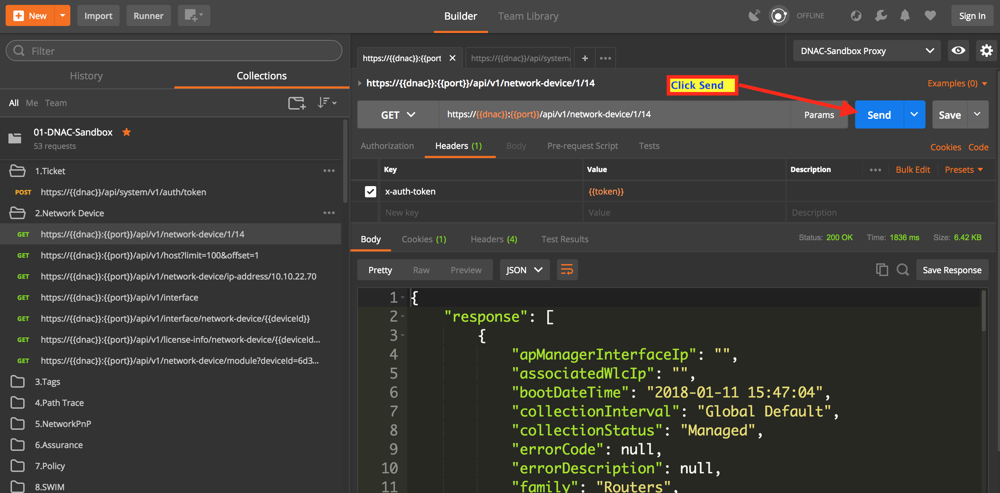
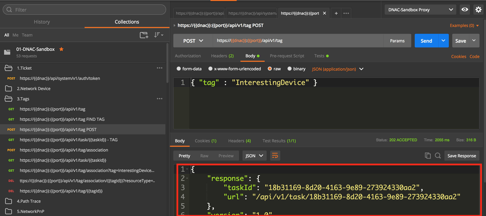
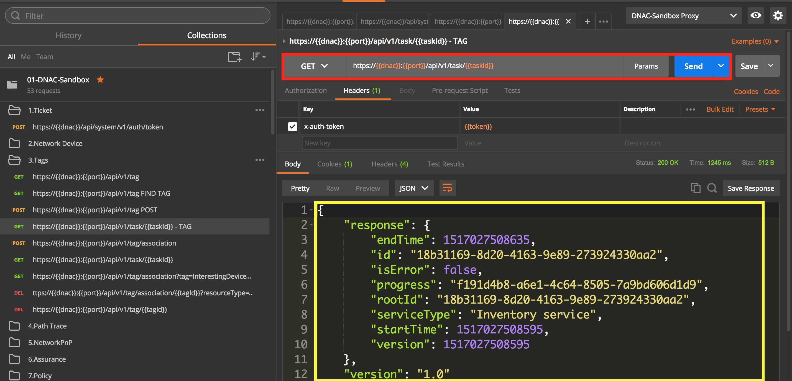
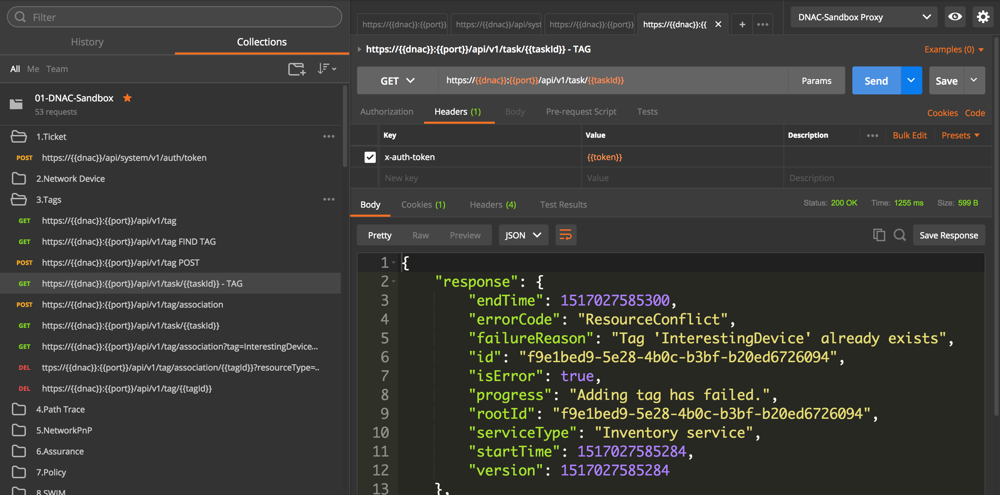
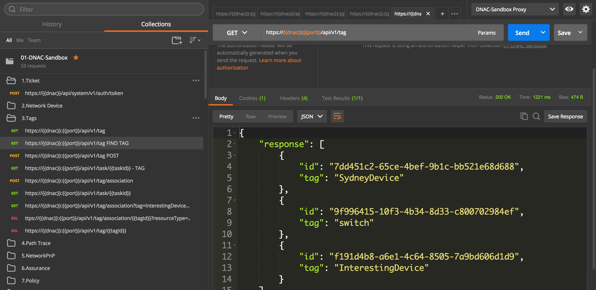
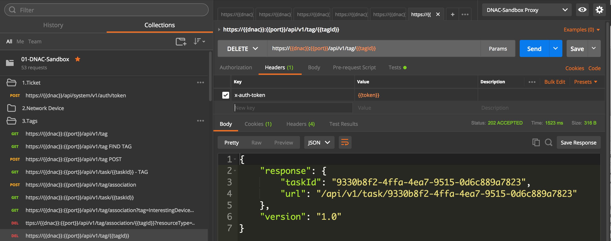
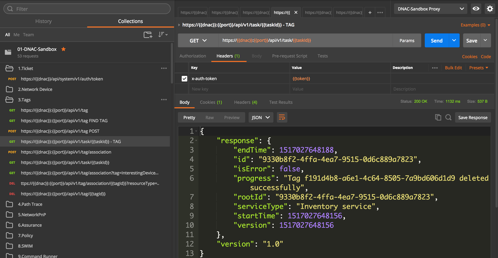

#Introduction

This is a collection and environment for Cisco Digital Network Architecture Controller (DNAC)

There is a default environment pointing to an always on sandbox.

By default the 'devnetuser' has read only access to the API.  In order to access a restricted set of POST/DELETE 
API there is a proxy running on port 8080.
 
To use these examples, you need the latest version of postman (3.2.0).
It has free Jetpacks support.  This is required for linking requests.

#Importing
You need to import the collection as well as the environment.  You can import the raw git files using the **From URL** option, as seen below.
You can also download them and import from file/folder.

* https://raw.githubusercontent.com/CiscoDevNet/dnac-samples-aradford/master/tools/postman/DNAC-Sandbox.postman_environment.json
* https://raw.githubusercontent.com/CiscoDevNet/dnac-samples-aradford/master/tools/postman/DNAC-Sandbox Proxy.postman_environment.json
* https://raw.githubusercontent.com/CiscoDevNet/dnac-samples-aradford/master/tools/postman/01-DNAC-Sandbox.postman_collection.json


#Getting Started
After the import has completed, you will need to select the environment.  You will notice there are two options.
* DNAC-Sandbox.postman_environment - this is a base environment that just talks to DNAC on port 443.
* DNAC-Sandbox Proxy.postman_environment - this talks to a proxy.  The reason for doing this is that devnetuser is read-only
so has no way to execute PUT/POST/DELETE

Once you have done this, you need to first run the request to get a Ticket.  This request is in the **1.Ticket folder**.
The authentication token will then be used in subsequent requests.  It is stored in an environment variable.


**NOTE: If this request fails you may need to accept the certificate from the controller in your browser**
http://blog.getpostman.com/2014/01/28/using-self-signed-certificates-with-postman/


Inside each folder, the requests are sequential.  GET/POST/DELETE etc.  So you can run through them one by one.
You can also check on the UI for the controller to see the effect of the requests.



#More Advanced API Calls

Most of the calls on the controller are asynchronous (PUT/POST/DELETE).  When you execute these calls, they will always
succeed and return a taskId.  Take a look at 3.Tags and Locations.  Select and run the second request which is a POST, 
to create a new Tag called "InterestingDevice".  


The response from the previous request is a task.  This is an asynchronous request.  You need to poll the task status
to find out if the creation was really successful.

The next request in the list shows how to do this.  

Notice there is a {{taskId}} in the URL being called.  Anything inside the {{}}
is a variable.  In this case taskId.  This was set behind the scenes in the previous API call.  



The body of the response contains a "progress" key.  This indicates the Universally Unique ID (UUID) of the new Tag.  
This UUID can be used to lookup the tag directly, assign the tag to a network device (the next API call) or delete the
tag. 

"iserror" being false means the task was successful. The presence of "endTime" means the task has finished.
```
{
  "response": {
    "startTime": 1468020253637,
    "endTime": 1468020253742,
    "progress": "61ad238b-5ef8-4f19-b97e-092ce5e75ae4",
    "version": 1468020253637,
    "serviceType": "Inventory service",
    "isError": false,
    "rootId": "8d40a399-2821-41aa-bf57-d2613cda9f5d",
    "id": "8d40a399-2821-41aa-bf57-d2613cda9f5d"
  },
  "version": "1.0"
}
```

Lets take a look what happens if you try to create another tag with the same name.


Go back to the "https://{{apic}}:{{port}}/api/v1/tag POST"  request and Send.  


Then take a look at the task status "https://{{apic}}:{{port}}/api/v1/task - TAG"


```
{
  "response": {
    "startTime": 1468021088439,
    "endTime": 1468021088474,
    "progress": "Adding tag has failed.",
    "version": 1468021088439,
    "errorCode": "ResourceConflict",
    "serviceType": "Inventory service",
    "isError": true,
    "failureReason": "Tag InterestingDevice already exists.",
    "rootId": "8dde3059-2a38-4170-9fc7-09780be46fc0",
    "id": "8dde3059-2a38-4170-9fc7-09780be46fc0"
  },
  "version": "1.0"
}
```

This is because the tag already exists.  You can fix this.  You need to use the "https://{{apic}}:{{port}}/api/v1/tag FIND TAG
" request.  This has a side effect of setting the tagId to the UUID of the "InterestingDevice" tag.


You can then scroll down to the "https://{{apic}}:{{port}}/api/v1/tag -DELETE" request, and press Send


Again, you will get a taskId.  You can use any of the task GET requests.


Please make sure you clean up by either deleting through the UI or the POSTMAN window.


#Next Steps
You can create your own environment, or modify the existing one to point to your own server.


